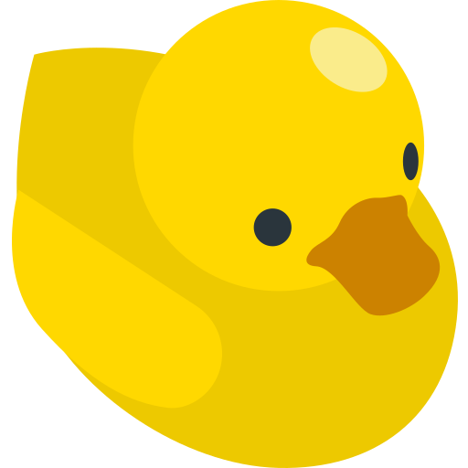

<p align="center">
  
</p>

# pi-rubber-duck

A rubber duck for your coding agent.

The model explains its problem out loud, one stretch at a time, to something that
never answers. Reading code is recognition. Explaining it is generation. The bug
usually turns up mid sentence, at the point where the next sentence refuses to be
written.

```text
🐤

"...the token should be non-null here..."

Keep explaining.
```

The duck said nothing. It quoted you.

## Why the duck stays quiet

There is a strong pull to make this thing smarter, so that it analyses the
explanation, suggests causes and grades the evidence. All of that breaks it. The
moment the duck says anything worth reacting to, the model stops talking and
starts replying, and replying is what was already going wrong.

So the duck only does three things.

1. It stays present, so the model keeps going.
2. It hands back one of the model's own sentences, picked but never reworded.
3. It refuses to stop early, because giving up after two sentences is how duck
   debugging fails.

No LLM calls, no network, and every response is deterministic.

## Install

```bash
git clone https://github.com/ChWehner/pi-rubber-duck.git \
  ~/.pi/agent/extensions/rubber-duck
```

Or install it as a pi package.

```bash
pi install git:github.com/ChWehner/pi-rubber-duck
# Or install the published package:
pi install npm:pi-rubber-duck
```

Then restart pi, or run `/reload`.

## How the loop works

The model calls `rubber_duck` once per stretch. The first matching rule wins.

| #   | Condition                                                         | Result                                                   |
| --- | ----------------------------------------------------------------- | -------------------------------------------------------- |
| 1   | `exit` is `must_measure`                                          | Stop. "Go measure it."                                   |
| 2   | `exit` is `found_it`, third call or later                         | Stop. "Verify it before editing."                        |
| 3   | `exit` is `exhausted` third call or later, or repetition shows up | Stop. "Talking is done. Read the path or instrument it." |
| 4   | anything else                                                     | Keep listening. Echo plus "Keep explaining."             |

`must_measure` can end the first call. The other exits need three calls unless
the explanation repeats. There is no turn cap.

## Which sentence it hands back

Four rules, first hit wins.

1. A sentence with a hedge in it, such as obviously, should return, must be,
   seems fine or somehow. That is where the model stopped checking.
2. Otherwise the opening framing, which is the assumption it walked in with.
3. Otherwise its own last sentence.
4. Otherwise nothing at all. A blank stretch does not get an invented quote.

## What you see, and getting a word in

A widget above the editor, refreshed on every stretch and left up for 30 seconds
from the latest one. It briefly waddles away before clearing. A final duck exit
clears it immediately.

```text
🐤
  The timer offset is per replica, so four pods drift independently.
  Say something anytime.
```

Interjections use pi's own steering. Type while the model is working and your
message arrives between stretches. The duck holds no lock and cannot force
another call, so you can always get a word in. Esc still stops everything.

## When it fires

The duck fires when one of these is true.

1. The first fix for this failure did not hold.
2. The model claims unobserved behaviour.
3. It is about to change several callers or files, or run something expensive.
4. It has read the same file twice without learning anything new.
5. It knows the result it wants but not the next concrete value.

A message about a failed fix adds a one-turn nudge toward the duck. It never
blocks. No match leaves the turn unchanged.

## Commands

| Command         | Effect                                                     |
| --------------- | ---------------------------------------------------------- |
| `/duck`         | Hand the current problem to the duck, one stretch per call |
| `/duck-credits` | Show the artwork credit                                    |

## Development

Requires Node.js 22.18 or newer.

```bash
npm install
npm run check
```

`npm run check` runs format, type, test and package checks.

## Contribute

Issue first, always. Open one with the bug, feature or chore template, then
branch off `develop` as `feature/…`, `bug/…` or `chore/…`, one problem per
branch. Fork the repo if you do not have push access.

Use an imperative commit subject under 72 characters. Pull requests target
`develop`, use the PR template and close their issue. `main` stays production-ready.
A `hotfix/…` starts from `main`, targets it and then lands in `develop`.

Before opening a PR, run `npm run check`, review the diff and keep it under 400
lines. A maintainer reviews and merges.

## Credits

[Rubber duck artwork](duck.png) by Magnific.

Built with [pi](https://github.com/badlogic/pi-mono).

## Licence

MIT, Christoph Wehner.
